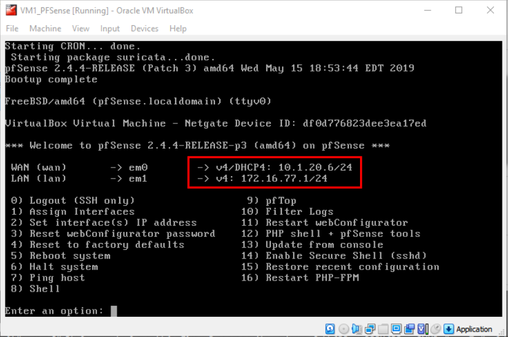

# Lab Environment Setup – Virtual Machine Deployment

## Overview

This guide documents the process used to deploy and configure all virtual machines required for the lab using Oracle VirtualBox.

Objectives:

- Import each provided OVA appliance
- Configure networking correctly
- Enable internal VM communication
- Validate connectivity across the lab environment

## Prerequisites

- Oracle VirtualBox installed
- VM OVA files downloaded
- Minimum 12 GB RAM recommended
- Credentials available from the lab appendix

# Setup Procedure

## Step 1 – Download VM Files

Download all required OVA files sequentially to improve reliability.  
Avoid downloading multiple files at once on slower connections.  
After deployment, use the Ubuntu VM to verify pfSense updates if required.

## Step 2 – Import pfSense Appliance

Locate `VM1_PFSense.ova` and double-click the file to begin importing into VirtualBox.

## Step 3 – Configure Import Options

Inside the import window:

- Uncheck **USB Controller**
- Select your desired base folder
- Click **Import**

## Step 4 – Monitor Import Progress

Wait for the import process to complete. A progress bar will display during this time.

## Step 5 – Confirm VM Appears

Verify the pfSense VM is now visible in the VirtualBox manager.

## Step 6 – Review Network Configuration (Critical Step)

Before starting the VM, open the settings to confirm proper network configuration.  
Correct settings ensure communication between all lab machines.

## Step 7 – Configure pfSense Adapters

### Adapter 1
Set to an internet-facing mode:
- Bridged OR
- NAT OR
- NAT Network

### Adapter 2
Set to:
- Internal Network → **TestNet**
- Advanced → Allow VMs

  

### Additional Requirement
For pfSense only:
- Promiscuous Mode → Allow All

## Step 8 – Start pfSense VM

Start the VM from the VirtualBox interface.

## Step 9 – Validate pfSense Interfaces

After boot:

- WAN should receive DHCP from your local network
- LAN should show static address: **172.16.77.1/24**

This confirms proper gateway configuration.

# Kali Linux Deployment

## Step 10 – Import Kali Appliance

Repeat the same import process for `VM2_Kali.ova`.

Network setting:
- Adapter 1 → Bridged

> Systems with less than 12 GB RAM may experience performance issues.

## Step 11 – Confirm Boot Screen

Wait until the Kali login screen appears.

## Step 12 – Log In

Use the provided credentials and open a terminal.

## Step 13 – Verify IP Address

Run:

`ifconfig`

Confirm the VM receives an IP address from your local subnet.

# Ubuntu Deployment

## Step 14 – Import Ubuntu Appliance

Import `VM3_Ubuntu.ova`.

Network setting:
- Adapter 1 → Internal Network (TestNet)

## Step 15 – Log In

Enter the provided username and password.

## Step 16 – Open Applications

Click **Show Applications** on the desktop.

## Step 17 – Launch Terminal

Open the terminal application.

## Step 18 – Validate Network Configuration

Run:

`ip addr`

Confirm the VM is on the same subnet as the pfSense LAN interface.

# Debian Deployment

## Step 19 – Import Debian Appliance

Import `VM4_Debian.ova`.

Network setting:
- Adapter 1 → Internal Network (TestNet)

## Step 20 – Boot VM

Wait for the login screen to appear.

## Step 21 – Log In

Enter the provided credentials.

## Step 22 – Open Applications

Click **Show Applications**.

## Step 23 – Search for Terminal

Open a terminal session.

## Step 24 – Validate IP Address

Run:

`ip addr`

Confirm the VM is within the same internal subnet.

## Step 25 – Environment Ready

All VMs are now:

- Imported
- Configured
- Networked
- Verified

The lab environment is fully prepared for testing and exercises.
